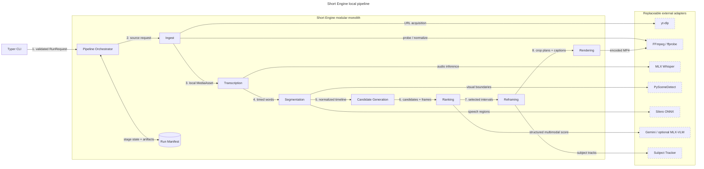

# Short Engine v1 Specification

Status: **Implemented and hardware-smoke validated**
Target: macOS Apple Silicon, reference hardware MacBook Pro M5 / 32 GB  
Delivery shape: local modular monolith with a CLI

## 1. Requirement

Build a local-first engine that accepts a long-form video, audio file, or
supported public URL and produces a ranked set of coherent, captioned short
clips. The engine must use Apple Silicon acceleration where it materially helps,
keep every pipeline stage replaceable behind a typed contract, and remain useful
without any SaaS, account, database, or graphical interface.

## 2. Scope

### In scope

- Local video/audio paths and URLs supported by yt-dlp.
- Probe, normalize, cache, transcribe, segment, generate candidates, rank,
  reframe, caption, and render.
- Portuguese and English initially; language may be explicitly supplied or
  detected.
- Horizontal input to configurable `9:16`, `1:1`, or `16:9` MP4 output.
- Apple-native ASR and local multimodal ranking, with an optional remote ranker
  adapter for quality comparisons.
- Resumable runs with inspectable JSON manifests and intermediate artifacts.
- CLI commands for environment diagnosis, full runs, analysis-only runs, and
  rendering an existing manifest.
- Offline default tests and an opt-in hardware/model smoke suite.

### Out of scope

- Authentication, accounts, billing, database servers, queues, multi-tenancy,
  browser UI, collaboration, or cloud deployment.
- Automatic publishing to YouTube, TikTok, Instagram, or other platforms.
- Generative B-roll, voice cloning, music generation, or synthetic presenters.
- Training/fine-tuning models in v1.
- Copyright enforcement or bypassing platform access controls.
- Frame-perfect active-speaker attribution in multi-person panels. V1 tracks the
  dominant visible subject; active-speaker detection remains an adapter upgrade.

## 3. Assumptions

- The primary machine is Apple Silicon with at least 16 GB unified memory; the
  reference machine has 32 GB.
- FFmpeg and ffprobe are installed through Homebrew and are treated as external
  executables.
- Local files are the canonical input. URL ingestion is convenience functionality
  implemented by yt-dlp and may require a user-selected browser profile.
- MLX inference is the default for ASR. Gemini is the primary ranker and must
  receive only the minimum transcript and sampled-frame evidence needed for a
  candidate; an MLX-VLM ranker remains an optional fully local adapter.
- Model names are configuration. The repository does not assume one checkpoint
  will remain best indefinitely.
- V1 optimizes podcasts, interviews, commentary, tutorials, and talking-head
  videos before gameplay-only or sports-highlight workloads.

## 4. Acceptance criteria

### AC-01 — Environment diagnosis

**Given** an Apple Silicon Mac, **when** `short-engine doctor` runs, **then** it
reports Python/MLX availability, FFmpeg/ffprobe versions, available Metal device,
model/cache paths, free disk space, and actionable failures without modifying the
machine.

### AC-02 — Local and URL ingestion

**Given** a readable media file or supported URL, **when** a run starts, **then**
the engine resolves it to a stable local source, records provenance and a content
fingerprint, and never downloads the same unchanged source twice.

**Given** a restricted URL, **when** a browser profile is supplied, **then** the
engine delegates cookie extraction to yt-dlp without persisting raw cookies in
the run manifest or logs.

### AC-03 — Resumable artifacts

**Given** a run interrupted after any completed stage, **when** the identical run
is resumed, **then** valid artifacts are reused and only incomplete or invalidated
stages execute again.

**Given** a model, prompt version, or material stage configuration change,
**when** the run resumes, **then** that stage and its downstream dependants are
invalidated while unrelated upstream artifacts remain reusable.

### AC-04 — Apple-native transcription

**Given** Portuguese or English speech, **when** transcription runs, **then** MLX
Whisper returns normalized segments and word-level timestamps, preserving model,
language, timing, and confidence metadata in the manifest.

**Given** silence or invalid audio, **when** transcription completes, **then** the
engine returns a typed no-speech or media error rather than fabricating text.

### AC-05 — Multisignal segmentation

**Given** a transcript and video, **when** analysis runs, **then** the engine
combines sentence/word boundaries, Silero VAD regions, and PySceneDetect scene
boundaries into a normalized timeline.

**Given** a multi-speaker source and enabled diarization, **when** segmentation
runs, **then** pyannote speaker turns are represented on the same canonical
timeline and candidate boundaries avoid cutting through a speaker turn when a
nearby valid boundary exists.

**Given** adjacent or overlapping boundaries, **when** they are normalized,
**then** the resulting intervals are monotonic, non-negative, within media
duration, and free of duplicated boundaries.

### AC-06 — Candidate generation

**Given** the normalized timeline, **when** candidates are generated, **then**
they satisfy configured duration limits, start/end on valid speech boundaries,
include enough context to form a complete thought, and carry provenance explaining
which signals created each boundary.

**Given** a long source, **when** windowed analysis is required, **then** local
timestamps are converted to absolute media timestamps exactly once and candidates
across windows can be deduplicated correctly.

### AC-07 — Multimodal ranking

**Given** candidates with transcripts and sampled frames, **when** ranking runs,
**then** a ranker returns schema-validated scores for hook strength, completeness,
information density, emotional payoff, visual support, and shareability, plus a
short rationale.

**Given** malformed or unavailable model output, **when** retries are exhausted,
**then** the stage fails with the raw response stored in a redacted debug artifact;
it must not silently invent or discard all candidates.

**Given** overlapping candidates, **when** final selection runs, **then** weighted
interval suppression retains the higher-scoring clip and records why the other
candidate was rejected.

### AC-08 — Scene-aware reframing

**Given** a selected landscape clip, **when** a vertical crop is planned, **then**
the engine tracks the dominant visible subject, smooths crop movement, respects
frame bounds, and resets tracking at scene boundaries.

**Given** no reliable subject detection, **when** fallback activates, **then** a
deterministic center crop is produced and the fallback is recorded in the
manifest.

### AC-09 — Captions and render

**Given** word-level timestamps, **when** a clip is rendered, **then** it contains
legible safe-area captions synchronized to speech, normalized audio, H.264 video,
AAC audio, and the requested aspect ratio with no stretched pixels.

**Given** an output file, **when** ffprobe validates it, **then** duration matches
the selected interval within 250 ms and all declared streams are decodable.

### AC-10 — CLI behavior

**Given** a valid input, **when** `short-engine run` executes, **then** progress is
shown per stage and the command returns zero only after requested clips and the
manifest pass validation.

**Given** analysis is already complete, **when** `short-engine render` receives
its manifest, **then** it can render selected candidate IDs without rerunning ASR
or ranking.

**Given** invalid flags, paths, models, or aspect ratios, **when** the CLI parses
them, **then** it exits non-zero with an actionable message and no partial output
outside the run directory.

### AC-11 — Observability and privacy

**Given** any run, **when** it completes or fails, **then** the manifest contains
stage status, elapsed time, model/config fingerprints, artifacts, warnings, and
errors without API keys, cookies, or transcript content in normal console logs.

### AC-12 — Quality and regression gates

**Given** the offline fixture suite, **when** quality gates run, **then** formatting,
lint, static typing, unit tests, integration tests, and coverage pass without
network or model downloads.

**Given** the Apple hardware smoke suite is explicitly enabled, **when** it runs,
**then** it processes a short fixture through real MLX, scene detection, subject
tracking, and FFmpeg render and emits a benchmark report per stage.

## 5. Reuse decisions and selected stack

| Capability | Selected owner | Why |
|---|---|---|
| Environment/dependencies | `uv`, Python 3.12 | Fast, reproducible project and lockfile management |
| CLI | Typer | Typed commands and first-class `CliRunner` testing |
| Boundary models | Pydantic v2 | Schema validation and JSON-schema generation |
| Media probe/render | FFmpeg + ffprobe subprocess adapter | Mature codec/filter implementation; do not reproduce it in Python |
| URL acquisition | yt-dlp subprocess adapter | Owns extractor churn, cookies, and JS challenge support |
| ASR | `mlx-whisper` | Apple-native inference and word-level timestamps |
| Speech activity | Silero VAD with ONNX Runtime | Lightweight speech boundaries without requiring PyTorch in the core path |
| Scene boundaries | PySceneDetect `AdaptiveDetector` | Maintained Python API and robust content-based detection |
| Optional speaker diarization | pyannote.audio Community-1 | Strong local open-source diarization; isolated because model download and CPU cost are optional |
| Primary multimodal ranker | Google Gen AI adapter | User-selected quality path with strict structured output; never a domain dependency |
| Optional local ranker | MLX-VLM | Fully local image/video-aware inference on Apple Silicon |
| Subject tracking | Ultralytics tracker on MPS behind `SubjectTracker` | Strong off-the-shelf detection/tracking; benchmark before locking a checkpoint |
| Captions | ASS subtitle generation + FFmpeg | Precise styling/timing without a custom video compositor |
| Tests | pytest + Typer `CliRunner` | Mature behavior and CLI testing |
| Quality | Ruff + Astral `ty` | Fast Rust-based lint, format, and type feedback suitable for every local run |

### Explicit non-selections

- `faster-whisper` is not the default because its accelerated path targets CUDA;
  it remains a future non-Mac adapter.
- MediaPipe is not the initial Python default because official package support
  for native Apple Silicon has historically lagged; it can be reconsidered after
  an installation/runtime benchmark on the reference machine.
- Haar cascades are excluded: they are legacy, brittle across OpenCV major
  versions, and insufficient for stable subject tracking.
- MoviePy is excluded from the render core; FFmpeg already owns this domain with
  lower overhead and clearer reproducibility.
- No workflow framework, task queue, ORM, or dependency-injection framework is
  introduced for a single-user local engine.

## 6. Architecture

The engine is one Python package with domain modules and adapter seams. Pipeline
orchestration owns ordering and artifact state; domain modules never invoke the
CLI or read environment variables.



### Representative data flow

1. `RunRequest` is validated at the CLI boundary and assigned a deterministic
   run ID from source fingerprint plus material configuration.
2. Ingest resolves/downloads the source, probes streams, and extracts analysis
   audio and low-resolution proxy assets.
3. Transcription produces a canonical `Transcript` with segment and word times.
4. Segmentation merges speech, optional speaker turns, and scene evidence into a
   `Timeline`.
5. Candidate generation produces deterministic windows before any LLM call.
6. Frame sampling attaches a small timestamped image set to each candidate.
7. Rankers return typed `CandidateAssessment` objects; the selector combines
   semantic and deterministic scores and suppresses overlap.
8. Reframing creates a time-varying crop plan rather than modifying pixels.
9. Rendering converts the plan and captions to an FFmpeg filtergraph, writes the
   MP4 atomically, validates it with ffprobe, and updates the manifest.

## 7. Contracts

Exact Python shapes may be refined during scaffold implementation, but consumers
must depend on these behavioral contracts:

```python
class SourceResolver(Protocol):
    def resolve(self, request: SourceRequest, run: RunContext) -> MediaAsset: ...

class Transcriber(Protocol):
    def transcribe(self, media: MediaAsset, config: ASRConfig) -> Transcript: ...

class BoundaryDetector(Protocol):
    def detect(self, media: MediaAsset, transcript: Transcript) -> BoundarySet: ...

class CandidateGenerator(Protocol):
    def generate(self, timeline: Timeline, config: CandidateConfig) -> list[Candidate]: ...

class CandidateRanker(Protocol):
    def rank(self, candidates: list[Candidate], evidence: EvidenceBundle) -> list[CandidateAssessment]: ...

class SubjectTracker(Protocol):
    def track(self, media: MediaAsset, interval: TimeRange) -> SubjectTrack: ...

class CropPlanner(Protocol):
    def plan(self, interval: TimeRange, track: SubjectTrack, profile: OutputProfile) -> CropPlan: ...

class Renderer(Protocol):
    def render(self, job: RenderJob, run: RunContext) -> RenderedClip: ...
```

No contract returns an untyped dictionary. Times use one canonical seconds-based
value object internally and are converted to FFmpeg strings only at the adapter.

## 8. State and artifact layout

Each run lives below a user-selected output root:

```text
<output>/<run-id>/
  manifest.json
  source/
  analysis/
  candidates/
  renders/
  debug/
```

The manifest is the source of truth. Artifact writes use a temporary sibling and
atomic rename. Cache validity is derived from input content fingerprint, stage
version, adapter/model fingerprint, and material configuration. Debug model
responses are opt-in, redacted, and never printed by default.

## 9. Error model

- Typed stage errors: `InputError`, `DependencyError`, `MediaError`,
  `InferenceError`, `ModelOutputError`, and `RenderError`.
- Errors include stage, safe context, remediation, and original cause chaining.
- One candidate render may fail without losing other successful clips; a full
  run is unsuccessful if fewer than the requested number validate.
- Signals and Ctrl-C stop after the active external process, preserve completed
  artifacts, and mark the run interrupted.
- No broad `except Exception` may convert failure into success.

## 10. CLI surface

```text
short-engine doctor
short-engine run INPUT [--clips N] [--aspect 9:16] [--language pt]
short-engine analyze INPUT [--ranker local|gemini]
short-engine render MANIFEST [--candidate ID ...]
short-engine inspect MANIFEST
```

Defaults and model selections live in one versioned configuration model. CLI
flags override config explicitly and the effective redacted configuration is
recorded in the manifest.

## 11. Verification map

| Acceptance criteria | Level | Discriminating verification |
|---|---|---|
| AC-01, AC-10 | CLI integration | Missing FFmpeg and invalid aspect produce specific non-zero outcomes |
| AC-02, AC-03 | Integration | Second identical run does no downloader/ASR work; config change invalidates only downstream stages |
| AC-04 | Contract + hardware smoke | Fake no-speech result fails; opt-in MLX fixture yields timed Portuguese words |
| AC-05, AC-06 | Unit/property | Generated times remain ordered/in-range; mutation of chunk offset or boundary clamp fails |
| AC-07 | Unit + adapter integration | Malformed schema fails visibly; overlap score mutation changes selected candidate and breaks test |
| AC-08 | Unit + fixture integration | Crop plan stays in bounds and fallback is observable; smoothing removal breaks continuity limit |
| AC-09 | FFmpeg integration | ffprobe verifies codecs, ratio, streams, and duration tolerance |
| AC-11 | Integration | Secret sentinel never appears in manifest/log capture; stage timing does |
| AC-12 | Full gate | Offline suite has no network; opt-in smoke emits benchmark JSON |

## 12. Implementation tasks

### T1 — Project foundation

**What:** Create the uv package, quality configuration, typed errors/models, and
Typer composition root.  
**Where:** `pyproject.toml`, `src/short_engine/{cli,core}/`, `tests/`.  
**Produces:** `RunRequest`, `RunContext`, `OutputProfile`, `ShortEngineError`, and
the `short-engine doctor` command.  
**Done when:** package installs from a clean checkout and AC-01/invalid CLI paths
pass.  
**Test:** pytest CLI integration, Ruff, type check; observe missing-dependency
test fail before implementation.

### T2 — Manifest and resumable stage runner

**What:** Implement content/config fingerprints, stage lifecycle, atomic artifact
registration, invalidation, and interruption state.  
**Where:** `src/short_engine/run/`.  
**Produces:** `RunManifest`, `Artifact`, `StageKey`, `StageRunner.execute(...)`.  
**Done when:** AC-03 and secret-redaction portion of AC-11 pass.  
**Test:** unit/property and filesystem integration; mutate a fingerprint input and
confirm the resume test fails.

### T3 — Media ingest adapters

**What:** Add local-file, yt-dlp, ffprobe, and FFmpeg normalization adapters.  
**Where:** `src/short_engine/ingest/`.  
**Produces:** `SourceResolver`, `MediaAsset`, `MediaProbe`.  
**Done when:** AC-02 passes for a local fixture and a mocked yt-dlp boundary;
real URL smoke remains opt-in.  
**Test:** real ffprobe fixture integration plus subprocess-boundary tests.

### T4 — MLX transcription

**What:** Implement MLX Whisper adapter and canonical timed transcript models.  
**Where:** `src/short_engine/transcription/`.  
**Produces:** `Transcriber`, `Transcript`, `TranscriptSegment`, `TimedWord`.  
**Done when:** AC-04 passes and transcripts round-trip through the manifest.  
**Test:** offline contract tests with a fake adapter; opt-in real MLX smoke.

### T5 — Timeline segmentation [P after T3/T4]

**What:** Combine PySceneDetect, Silero ONNX, optional pyannote speaker turns,
punctuation, and word boundaries.  
**Where:** `src/short_engine/segmentation/`.  
**Produces:** `BoundaryDetector`, `Boundary`, `BoundarySet`, `Timeline`.  
**Done when:** AC-05 passes on synthetic edge cases and a video fixture.  
**Test:** unit/property tests plus scene/VAD integration fixtures.

### T6 — Candidate generation [P after T5 contracts]

**What:** Generate context-complete candidate windows and deduplicate boundaries.  
**Where:** `src/short_engine/candidates/`.  
**Produces:** `CandidateGenerator`, `Candidate`, `CandidateEvidence`.  
**Done when:** AC-06 passes for short, long, overlapping, and sparse sources.  
**Test:** strict TDD for timestamp/window logic and manual mutation of offset math.

### T7 — Frame evidence and ranker adapters [P after T3/T6]

**What:** Sample representative frames, implement schema-validated MLX-VLM ranker,
optional Gemini adapter, deterministic feature scorer, and final selector.  
**Where:** `src/short_engine/ranking/`.  
**Produces:** `FrameSampler`, `CandidateRanker`, `CandidateAssessment`,
`CandidateSelector`.  
**Done when:** AC-07 passes and every decision is inspectable in the manifest.  
**Test:** schema/error unit tests, overlap selection tests, opt-in model contract
smoke; mutate score direction and require selection test failure.

### T8 — Subject tracking and crop planning [P after T3/T6]

**What:** Implement MPS subject-tracker adapter, scene resets, smoothing, safe-area
crop planner, and deterministic fallback.  
**Where:** `src/short_engine/reframing/`.  
**Produces:** `SubjectTracker`, `SubjectTrack`, `CropPlanner`, `CropPlan`.  
**Done when:** AC-08 passes without writing video frames in Python.  
**Test:** geometry/property tests and a real short fixture; mutation of smoothing
or bounds clamp must fail.

### T9 — Captions and FFmpeg rendering

**What:** Generate ASS captions/filtergraphs, render atomically, normalize audio,
and validate with ffprobe.  
**Where:** `src/short_engine/rendering/`.  
**Produces:** `CaptionRenderer`, `Renderer`, `RenderJob`, `RenderedClip`.  
**Done when:** AC-09 passes for all three output profiles.  
**Test:** FFmpeg integration tests asserting codecs, ratio, duration, and captions.

### T10 — Pipeline and CLI completion

**What:** Compose adapters, implement `run/analyze/render/inspect`, progress,
cancellation, and partial-render policy.  
**Where:** `src/short_engine/pipeline/`, `src/short_engine/cli/`.  
**Produces:** `Engine.run(...)`, stable CLI commands, complete manifest.  
**Done when:** AC-10/AC-11 and the offline end-to-end fixture pass.  
**Test:** CLI e2e with fakes plus real FFmpeg fixture; clean-context review against
all acceptance criteria.

### T11 — Apple hardware validation and baseline

**What:** Run the opt-in real-model path on the reference M5/32 GB Mac and record
model compatibility, stage timing, peak memory, output validity, and quality notes.  
**Where:** `tests/hardware/`, benchmark artifact documented in the release notes.  
**Done when:** AC-12 smoke path passes and default checkpoints are selected from
measured results rather than assumptions.  
**Test:** one short Portuguese fixture and one multi-scene English fixture.

## 13. Definition of done

V1 is complete only when every acceptance criterion has a test citation, the
offline suite is green, the two high-risk mutation checks fail as expected, the
Apple hardware smoke produces validated clips, and an independent review finds
no unresolved high-severity mismatch with this specification.

## 14. Decision evidence

Stack choices were checked on 2026-08-28 against current primary project docs:

- [MLX Whisper](https://github.com/ml-explore/mlx-examples/tree/main/whisper):
  Apple-native Whisper API with word-level timestamps.
- [MLX-VLM](https://github.com/Blaizzy/mlx-vlm): local Apple Silicon VLM
  inference, multi-image/video inputs, and structured response formats.
- [PySceneDetect](https://github.com/Breakthrough/PySceneDetect): maintained
  content/adaptive scene detection with typed timecodes.
- [Silero VAD](https://github.com/snakers4/silero-vad): maintained VAD with an
  ONNX execution path.
- [pyannote.audio](https://github.com/pyannote/pyannote-audio): Community-1
  speaker diarization with a documented fully local/offline deployment path.
- [yt-dlp](https://github.com/yt-dlp/yt-dlp): extractor, browser-cookie, and
  JavaScript-challenge ownership.
- [FFmpeg](https://github.com/FFmpeg/FFmpeg): media probe, filters, codecs, and
  final muxing.
- [Typer](https://github.com/fastapi/typer): typed commands and CLI testing.
- [ty](https://github.com/astral-sh/ty), [Ruff](https://github.com/astral-sh/ruff),
  and [uv](https://github.com/astral-sh/uv): the local development toolchain.

Model checkpoints and tracking models remain benchmark-selected configuration,
because pinning “SOTA” names in architecture would make the design stale.

## 15. Editorial quality contract

The batch engine first constructs one global semantic map of the complete video:
subjects, hooks, premises, evidence, and explicit payoffs. It then proposes
typed edit plans rather than scoring fixed-duration windows in isolation.

The supported production strategies are deliberately small:

- `continuous`: one chronological 10-60 second source interval;
- `payoff_teaser`: a 0.5-3 second excerpt copied from the plan's own payoff,
  followed by the complete chronological interval containing that payoff.

Every plan declares local hook and payoff ranges inside its main interval. A
teaser must be contained by that same payoff; arbitrary sentence reordering and
cross-topic concatenation are forbidden. Timestamps are normalized only to a
nearby transcript boundary, otherwise the plan fails.

An independent multimodal verifier evaluates the exact playback transcript and
video ranges for coherence, standalone clarity, referential completeness,
meaning preservation, and whether the payoff resolves the opening. Only plans
that pass every invariant and the hook/retention thresholds may render.
Requesting a clip count never overrides this gate.

For vertical reaction content, a persistent person detection in a peripheral
source region is treated as a facecam overlay rather than the sole crop target.
The renderer places its robust motion envelope in the upper third and uses a
centered crop of the underlying content in the lower two thirds. Ordinary
talking-head footage and moving full-frame subjects remain on the standard
scene-aware crop path.

Genre grammar is configuration, not branching pipeline code. Audio direction is
optional and depends on an explicitly licensed local catalog with provenance.
Music and effects amplify story beats but must not be required for a valid
render.

Near-live clipping is a separate orchestrator over shared domain services. It
uses rolling media, incremental signals, and a highlight state machine; a clip
may only become ready after a payoff signal. Live ingestion, publishing, and
platform authentication remain outside the batch engine.
